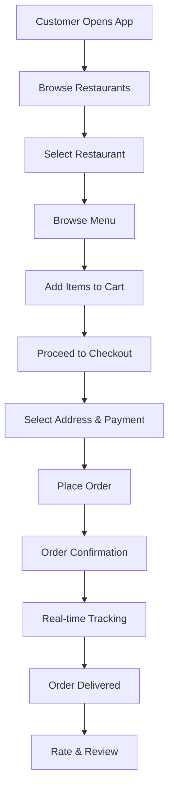
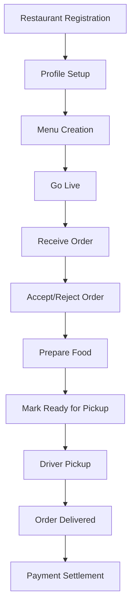
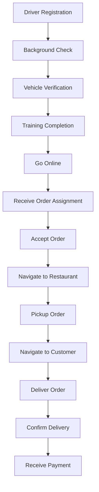
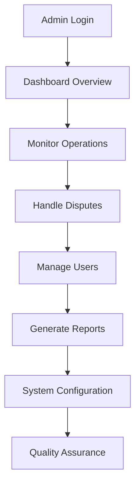

# 🏗️ FoodieExpress - Microservices Architecture Documentation

## 📋 Table of Contents
- [Architecture Overview](#architecture-overview)
- [Core Business Flows](#core-business-flows)
- [Microservices Detailed Design](#microservices-detailed-design)
- [Data Flow & Communication](#data-flow--communication)
- [Real-time Features](#real-time-features)
- [Security Architecture](#security-architecture)

## 🎯 Architecture Overview

### System Architecture Diagram
```
┌─────────────────┐    ┌─────────────────┐    ┌─────────────────┐
│   Customer App  │    │ Restaurant App  │    │   Driver App    │
│   (React PWA)   │    │  (React Admin)  │    │ (React Native)  │
└─────────┬───────┘    └─────────┬───────┘    └─────────┬───────┘
          │                      │                      │
          └──────────────────────┼──────────────────────┘
                                 │
                    ┌─────────────┴─────────────┐
                    │      API Gateway          │
                    │   (Express.js/Kong)       │
                    └─────────────┬─────────────┘
                                  │
        ┌─────────────────────────┼─────────────────────────┐
        │                         │                         │
┌───────▼────────┐    ┌──────────▼──────────┐    ┌─────────▼────────┐
│  User Service  │    │  Restaurant Service │    │  Order Service   │
│   (Node.js)    │    │     (Node.js)       │    │   (Node.js)      │
└────────────────┘    └─────────────────────┘    └──────────────────┘
        │                         │                         │
┌───────▼────────┐    ┌──────────▼──────────┐    ┌─────────▼────────┐
│ Payment Service│    │   Menu Service      │    │ Delivery Service │
│   (Node.js)    │    │     (Node.js)       │    │   (Node.js)      │
└────────────────┘    └─────────────────────┘    └──────────────────┘
        │                         │                         │
┌───────▼────────┐    ┌──────────▼──────────┐    ┌─────────▼────────┐
│Notification Svc│    │   Review Service    │    │  Search Service  │
│   (Node.js)    │    │     (Node.js)       │    │   (Node.js)      │
└────────────────┘    └─────────────────────┘    └──────────────────┘
        │                         │                         │
        └─────────────────────────┼─────────────────────────┘
                                  │
                    ┌─────────────▼─────────────┐
                    │     Message Broker        │
                    │    (Apache Kafka)         │
                    └───────────────────────────┘
```

## 🔄 Core Business Flows

### 1. Customer Journey Flow


### 2. Restaurant Journey Flow


### 3. Driver Journey Flow


### 4. Admin Journey Flow


## 🏗️ Microservices Detailed Design

### 1. User Service
**Port**: 3001  
**Database**: users_db  
**Responsibilities**:
- User authentication (JWT + Refresh tokens)
- User profile management
- Role-based access control
- Social login integration
- Password reset functionality

**API Endpoints**:
```
POST   /api/auth/register
POST   /api/auth/login
POST   /api/auth/refresh
POST   /api/auth/logout
GET    /api/users/profile
PUT    /api/users/profile
POST   /api/auth/forgot-password
POST   /api/auth/reset-password
POST   /api/auth/verify-email
```

**Data Models**:
```javascript
// User Schema
{
  _id: ObjectId,
  email: String,
  password: String (hashed),
  role: Enum['customer', 'restaurant', 'driver', 'admin'],
  profile: {
    firstName: String,
    lastName: String,
    phone: String,
    avatar: String,
    addresses: [AddressSchema],
    preferences: Object
  },
  isVerified: Boolean,
  isActive: Boolean,
  createdAt: Date,
  updatedAt: Date
}
```

### 2. Restaurant Service
**Port**: 3002  
**Database**: restaurants_db  
**Responsibilities**:
- Restaurant registration and onboarding
- Restaurant profile management
- Operating hours and availability
- Restaurant verification and approval

**API Endpoints**:
```
POST   /api/restaurants
GET    /api/restaurants
GET    /api/restaurants/:id
PUT    /api/restaurants/:id
DELETE /api/restaurants/:id
PUT    /api/restaurants/:id/status
GET    /api/restaurants/:id/analytics
```

**Data Models**:
```javascript
// Restaurant Schema
{
  _id: ObjectId,
  ownerId: ObjectId,
  name: String,
  description: String,
  cuisine: [String],
  address: AddressSchema,
  location: {
    type: "Point",
    coordinates: [longitude, latitude]
  },
  operatingHours: {
    monday: { open: String, close: String, isOpen: Boolean },
    // ... other days
  },
  images: [String],
  rating: Number,
  totalReviews: Number,
  isVerified: Boolean,
  isActive: Boolean,
  deliveryRadius: Number,
  minimumOrder: Number,
  deliveryFee: Number,
  estimatedDeliveryTime: Number,
  createdAt: Date,
  updatedAt: Date
}
```

### 3. Product/Menu Service
**Port**: 3003  
**Database**: menus_db  
**Responsibilities**:
- Menu item management
- Categories and pricing
- Inventory tracking
- Nutritional information

**API Endpoints**:
```
GET    /api/restaurants/:restaurantId/menu
POST   /api/restaurants/:restaurantId/menu/items
PUT    /api/restaurants/:restaurantId/menu/items/:itemId
DELETE /api/restaurants/:restaurantId/menu/items/:itemId
GET    /api/restaurants/:restaurantId/menu/categories
POST   /api/restaurants/:restaurantId/menu/categories
```

**Data Models**:
```javascript
// Menu Item Schema
{
  _id: ObjectId,
  restaurantId: ObjectId,
  name: String,
  description: String,
  price: Number,
  category: String,
  images: [String],
  isVegetarian: Boolean,
  isVegan: Boolean,
  isGlutenFree: Boolean,
  spiceLevel: Number,
  calories: Number,
  ingredients: [String],
  allergens: [String],
  customizations: [{
    name: String,
    options: [{
      name: String,
      price: Number
    }]
  }],
  isAvailable: Boolean,
  preparationTime: Number,
  createdAt: Date,
  updatedAt: Date
}
```

### 4. Order Service
**Port**: 3004  
**Database**: orders_db  
**Responsibilities**:
- Order creation and management
- Order status tracking
- Order history
- Order analytics

**API Endpoints**:
```
POST   /api/orders
GET    /api/orders
GET    /api/orders/:id
PUT    /api/orders/:id/status
GET    /api/orders/customer/:customerId
GET    /api/orders/restaurant/:restaurantId
GET    /api/orders/driver/:driverId
POST   /api/orders/:id/cancel
```

**Data Models**:
```javascript
// Order Schema
{
  _id: ObjectId,
  orderNumber: String,
  customerId: ObjectId,
  restaurantId: ObjectId,
  driverId: ObjectId,
  items: [{
    menuItemId: ObjectId,
    name: String,
    price: Number,
    quantity: Number,
    customizations: [Object]
  }],
  subtotal: Number,
  tax: Number,
  deliveryFee: Number,
  discount: Number,
  total: Number,
  status: Enum['placed', 'confirmed', 'preparing', 'ready', 'picked_up', 'on_the_way', 'delivered', 'cancelled'],
  deliveryAddress: AddressSchema,
  paymentMethod: String,
  paymentStatus: Enum['pending', 'paid', 'failed', 'refunded'],
  estimatedDeliveryTime: Date,
  actualDeliveryTime: Date,
  specialInstructions: String,
  createdAt: Date,
  updatedAt: Date
}
```

### 5. Payment Service
**Port**: 3005  
**Database**: payments_db  
**Responsibilities**:
- Payment processing (Stripe, PayPal)
- Transaction management
- Refund processing
- Payment method management

**API Endpoints**:
```
POST   /api/payments/process
POST   /api/payments/refund
GET    /api/payments/methods/:userId
POST   /api/payments/methods
DELETE /api/payments/methods/:methodId
GET    /api/payments/transactions/:userId
POST   /api/payments/webhooks/stripe
```

**Data Models**:
```javascript
// Payment Schema
{
  _id: ObjectId,
  orderId: ObjectId,
  userId: ObjectId,
  amount: Number,
  currency: String,
  paymentMethod: String,
  paymentIntentId: String,
  status: Enum['pending', 'succeeded', 'failed', 'cancelled', 'refunded'],
  transactionId: String,
  refundAmount: Number,
  refundReason: String,
  createdAt: Date,
  updatedAt: Date
}
```

### 6. Delivery Service
**Port**: 3006  
**Database**: deliveries_db  
**Responsibilities**:
- Driver assignment algorithms
- Real-time GPS tracking
- Route optimization
- Delivery status updates

**API Endpoints**:
```
POST   /api/deliveries/assign
GET    /api/deliveries/:id/tracking
PUT    /api/deliveries/:id/location
PUT    /api/deliveries/:id/status
GET    /api/deliveries/driver/:driverId/active
POST   /api/deliveries/:id/proof
GET    /api/deliveries/:id/route
```

**Data Models**:
```javascript
// Delivery Schema
{
  _id: ObjectId,
  orderId: ObjectId,
  driverId: ObjectId,
  restaurantLocation: {
    type: "Point",
    coordinates: [longitude, latitude]
  },
  customerLocation: {
    type: "Point",
    coordinates: [longitude, latitude]
  },
  currentLocation: {
    type: "Point",
    coordinates: [longitude, latitude]
  },
  status: Enum['assigned', 'en_route_to_restaurant', 'at_restaurant', 'picked_up', 'en_route_to_customer', 'delivered'],
  estimatedDistance: Number,
  actualDistance: Number,
  estimatedDuration: Number,
  actualDuration: Number,
  proofOfDelivery: {
    photo: String,
    signature: String,
    notes: String
  },
  createdAt: Date,
  updatedAt: Date
}
```

### 7. Notification Service
**Port**: 3007  
**Database**: notifications_db  
**Responsibilities**:
- Push notifications (Firebase)
- SMS notifications (Twilio)
- Email notifications (SendGrid)
- Real-time updates (Socket.IO)

**API Endpoints**:
```
POST   /api/notifications/send
GET    /api/notifications/:userId
PUT    /api/notifications/:id/read
POST   /api/notifications/subscribe
DELETE /api/notifications/unsubscribe
GET    /api/notifications/preferences/:userId
PUT    /api/notifications/preferences/:userId
```

### 8. Review/Rating Service
**Port**: 3008  
**Database**: reviews_db  
**Responsibilities**:
- Restaurant reviews and ratings
- Driver reviews and ratings
- Review moderation
- Rating analytics

**API Endpoints**:
```
POST   /api/reviews/restaurant
POST   /api/reviews/driver
GET    /api/reviews/restaurant/:restaurantId
GET    /api/reviews/driver/:driverId
PUT    /api/reviews/:id
DELETE /api/reviews/:id
GET    /api/reviews/:id/report
```

### 9. Search/Recommendation Service
**Port**: 3009  
**Database**: search_db (Elasticsearch)  
**Responsibilities**:
- Advanced search functionality
- AI-powered recommendations
- Trending restaurants
- Personalized suggestions

**API Endpoints**:
```
GET    /api/search/restaurants
GET    /api/search/menu-items
GET    /api/recommendations/:userId
GET    /api/trending/restaurants
GET    /api/search/suggestions
POST   /api/search/index/restaurant
POST   /api/search/index/menu-item
```

## 🔄 Data Flow & Communication

### Inter-Service Communication Patterns

#### 1. Synchronous Communication (REST APIs)
- **Use Case**: Real-time data retrieval, immediate responses
- **Examples**: User authentication, menu fetching, order placement
- **Technology**: HTTP/HTTPS with JSON payloads

#### 2. Asynchronous Communication (Event-Driven)
- **Use Case**: Background processing, eventual consistency
- **Examples**: Order status updates, payment processing, notifications
- **Technology**: Apache Kafka with event sourcing

#### 3. Real-time Communication (WebSockets)
- **Use Case**: Live updates, real-time tracking
- **Examples**: Order tracking, driver location updates
- **Technology**: Socket.IO

### Event Flow Examples

#### Order Placement Event Flow
```
1. Customer places order → Order Service
2. Order Service publishes "OrderPlaced" event → Kafka
3. Payment Service consumes event → Process payment
4. Payment Service publishes "PaymentProcessed" event → Kafka
5. Restaurant Service consumes event → Notify restaurant
6. Notification Service consumes event → Send confirmation to customer
7. Delivery Service consumes event → Find available driver
```

#### Real-time Tracking Event Flow
```
1. Driver updates location → Delivery Service
2. Delivery Service publishes "LocationUpdated" event → Kafka
3. Notification Service consumes event → Send real-time update via Socket.IO
4. Customer app receives location update → Update map
```

## 🚀 Real-time Features Implementation

### 1. Real-time Order Tracking
**Technology**: Socket.IO + Google Maps API

**Implementation**:
```javascript
// Driver location update
const updateDriverLocation = (driverId, location) => {
  // Update database
  await DeliveryService.updateLocation(driverId, location);
  
  // Emit to customer
  io.to(`order_${orderId}`).emit('driverLocationUpdate', {
    location,
    timestamp: new Date()
  });
};

// Customer tracking subscription
socket.on('trackOrder', (orderId) => {
  socket.join(`order_${orderId}`);
});
```

### 2. Real-time Order Status Updates
```javascript
// Order status change
const updateOrderStatus = async (orderId, status) => {
  await OrderService.updateStatus(orderId, status);
  
  // Emit to all relevant parties
  io.to(`order_${orderId}`).emit('orderStatusUpdate', {
    orderId,
    status,
    timestamp: new Date()
  });
  
  // Send push notification
  await NotificationService.sendPushNotification(customerId, {
    title: 'Order Update',
    body: `Your order is now ${status}`
  });
};
```

### 3. Real-time Restaurant Dashboard
```javascript
// New order notification for restaurant
const notifyNewOrder = (restaurantId, order) => {
  io.to(`restaurant_${restaurantId}`).emit('newOrder', order);
  
  // Play notification sound
  io.to(`restaurant_${restaurantId}`).emit('playNotificationSound');
};
```

## 🔒 Security Architecture

### 1. Authentication & Authorization
- **JWT Tokens**: Access tokens (15 min) + Refresh tokens (7 days)
- **Role-based Access Control**: Customer, Restaurant, Driver, Admin roles
- **Multi-factor Authentication**: SMS/Email verification for sensitive operations

### 2. API Security
- **Rate Limiting**: Redis-based rate limiting per user/IP
- **Input Validation**: Joi schema validation for all inputs
- **SQL Injection Prevention**: Mongoose ODM with parameterized queries
- **CORS Configuration**: Whitelist allowed origins

### 3. Data Protection
- **Encryption at Rest**: MongoDB encryption
- **Encryption in Transit**: TLS 1.3 for all communications
- **PII Protection**: Hash sensitive data, tokenize payment information
- **GDPR Compliance**: Data anonymization and deletion capabilities

### 4. Infrastructure Security
- **Container Security**: Distroless base images, security scanning
- **Network Security**: VPC, security groups, private subnets
- **Secrets Management**: AWS Secrets Manager for API keys
- **Monitoring**: Real-time security alerts and anomaly detection

## 📊 Performance & Scalability

### 1. Caching Strategy
- **Redis Cluster**: Session storage, frequently accessed data
- **CDN**: Static assets, images, videos
- **Database Caching**: Query result caching with TTL

### 2. Database Optimization
- **Indexing**: Compound indexes for complex queries
- **Sharding**: Horizontal partitioning for large collections
- **Read Replicas**: Separate read/write operations

### 3. Load Balancing
- **Application Load Balancer**: Distribute traffic across instances
- **Database Load Balancing**: Read/write splitting
- **Geographic Distribution**: Multi-region deployment

### 4. Monitoring & Observability
- **Metrics**: Prometheus + Grafana dashboards
- **Logging**: ELK Stack (Elasticsearch, Logstash, Kibana)
- **Tracing**: Distributed tracing with Jaeger
- **Health Checks**: Kubernetes liveness and readiness probes

---

This architecture provides a robust, scalable foundation for the FoodieExpress platform, ensuring high availability, performance, and security while maintaining the flexibility to evolve with business requirements.
